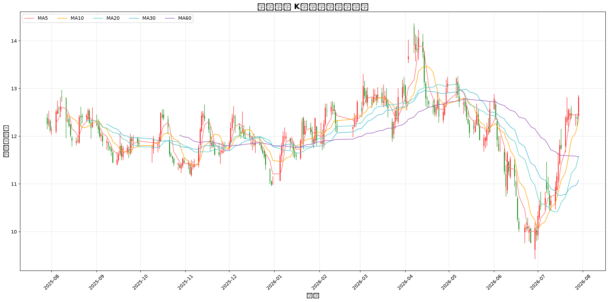
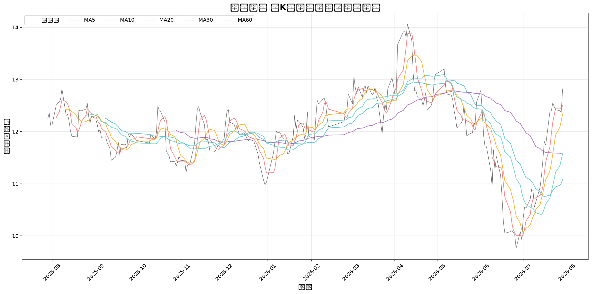

## Smolagents 简介
Hugging Face 团队于2024年12月开源的开发框架。

官网：https://huggingface.co/docs/smolagents/index

## 传统CodeAct 模式


### 提示词设计

```txt
你是一个在 {os.getcwd()} 目录下的能够编写和执行代码的智能助手。
当用户提出问题时，你需要：
1. 分析问题并确定需要编写什么代码
2. 编写能解决问题的Python代码
3. 使用execute_python工具执行代码
4. 分析执行结果，如果有错误则修改代码再次执行
5. 最终给用户提供答案

请确保你的代码能够正确执行并将最终结果存储在名为'result'的变量中。
```

### 代码解释器设计
模型生成的代码必须在一个真实的运行环境中落地，才能获取到实际结果，因此我们需要设计一个代码解释器。在工业生产环境中，为了保障系统安全，通常会采用容器化沙箱（如 Docker）、受限解释器或专用的远程执行服务，这里简单使用 Python 内置的  exec。

```python
def execute_python(code: str) -> str:
    """执行Python代码并返回结果。"""
    try:
        print("##执行代码:\n",code)
        # 创建本地环境执行代码
        local_vars = {}
        exec(code, {}, local_vars)  # python可以动态 执行 代码
        result= local_vars.get('result', '执行成功')
        print("##执行结果:\n",result)
        return str(result)
    except Exception as e:
        return f"Error executing code: {str(e)}
```


### Agent Loop 的实现

```python
def agent_loop(messages):
    max_rounds = 10
    current_round = 0

    while True:
        current_round += 1

        if current_round > max_rounds:
            print(f"Maximum rounds {max_rounds} reached, exiting")
            sys.exit(0)

        response = send_messages(messages)

        if response.choices[0].message.tool_calls != None:
            messages.append(response.choices[0].message)
            
            for tool_call in response.choices[0].message.tool_calls:
                if tool_call.function.name == "execute_python":
                    arguments_dict = json.loads(tool_call.function.arguments)
                    result = execute_python(arguments_dict['code'])
                    
                    messages.append({
                        "role": "tool",
                        "content": result,
                        "tool_call_id": tool_call.id
                    })
        else:
            break
```

[完整代码](https://github.com/zjlyyq/geektime-keepsake/tree/main/herness-agent/chapter/02/codeact-demo)


### 使用效果
```sh
(myenv) zhangjialu6@MacBook-Air-5 codeact-demo % python agent.py
user >> 请读取yanjing_beer_daily_k_20250729_20260729.csv中的数据，之后计算移动平均线，并画出这些线
user >> 


──────────────────────────── Calling LLM (round 1) ─────────────────────────────
ChatCompletionMessage(content='我来先读取CSV文件，了解数据结构，然后计算移动平均线并绘图。', refusal=None, role='assistant', annotations=None, audio=None, function_call=None, tool_calls=[ChatCompletionMessageFunctionToolCall(id='call_00_wlft4jXaElVrgQz55LuQ0828', function=Function(arguments='{"code": "\\nimport pandas as pd\\n\\n# 读取CSV文件\\ndf = pd.read_csv(\'yanjing_beer_daily_k_20250729_20260729.csv\')\\nprint(\\"数据形状:\\", df.shape)\\nprint(\\"\\\\n列名:\\", df.columns.tolist())\\nprint(\\"\\\\n前5行:\\")\\nprint(df.head())\\nprint(\\"\\\\n数据类型:\\")\\nprint(df.dtypes)\\nprint(\\"\\\\n基本统计:\\")\\nprint(df.describe())\\n"}', name='execute_python'), type='function', index=0)], reasoning_content='用户想要我：\n1. 读取文件 `yanjing_beer_daily_k_20250729_20260729.csv`\n2. 计算移动平均线\n3. 画出这些线\n\n首先，让我读取这个CSV文件，查看其结构和内容。')
┌───── Thinking ───────────────────────────────────────────────────────────────┐
│ 用户想要我：                                                                 │
│ 1. 读取文件 `yanjing_beer_daily_k_20250729_20260729.csv`                     │
│ 2. 计算移动平均线                                                            │
│ 3. 画出这些线                                                                │
│                                                                              │
│ 首先，让我读取这个CSV文件，查看其结构和内容。                                │
└──────────────────────────────────────────────────────────────────────────────┘
┌───── Answer ─────────────────────────────────────────────────────────────────┐
│ 我来先读取CSV文件，了解数据结构，然后计算移动平均线并绘图。                  │
└──────────────────────────────────────────────────────────────────────────────┘
##执行代码:
 
import pandas as pd

# 读取CSV文件
df = pd.read_csv('yanjing_beer_daily_k_20250729_20260729.csv')
print("数据形状:", df.shape)
print("\n列名:", df.columns.tolist())
print("\n前5行:")
print(df.head())
print("\n数据类型:")
print(df.dtypes)
print("\n基本统计:")
print(df.describe())

数据形状: (243, 12)

列名: ['日期', '股票代码', '开盘', '收盘', '最高', '最低', '成交量', '成交额', '振幅', '涨跌幅', '涨跌额', '换手率']

前5行:
           日期  股票代码     开盘     收盘     最高  ...           成交额    振幅   涨跌幅   涨跌额   换手率
0  2025-07-29   729  12.39  12.25  12.47  ...  2.762085e+08  2.57 -1.69 -0.21  0.88
1  2025-07-30   729  12.24  12.36  12.53  ...  2.981109e+08  2.69  0.90  0.11  0.94
2  2025-07-31   729  12.32  12.12  12.35  ...  2.128855e+08  2.18 -1.94 -0.24  0.68
3  2025-08-01   729  12.13  12.13  12.20  ...  2.246072e+08  1.40  0.08  0.01  0.72
4  2025-08-04   729  12.10  12.51  12.56  ...  3.629815e+08  4.12  3.13  0.38  1.14

[5 rows x 12 columns]

数据类型:
日期          str
股票代码      int64
开盘      float64
收盘      float64
最高      float64
最低      float64
成交量       int64
成交额     float64
振幅      float64
涨跌幅     float64
涨跌额     float64
换手率     float64
dtype: object

基本统计:
        股票代码          开盘          收盘  ...         涨跌幅         涨跌额         换手率
count  243.0  243.000000  243.000000  ...  243.000000  243.000000  243.000000
mean   729.0   12.015021   12.028436  ...    0.030082    0.001481    1.213457
std      0.0    0.735135    0.720540  ...    1.923354    0.230177    0.540079
min    729.0    9.620000    9.760000  ...   -4.930000   -0.630000    0.290000
25%    729.0   11.685000   11.705000  ...   -0.965000   -0.120000    0.810000
50%    729.0   12.070000   12.060000  ...   -0.080000   -0.010000    1.110000
75%    729.0   12.435000   12.495000  ...    0.955000    0.110000    1.500000
max    729.0   14.300000   14.060000  ...    7.380000    0.940000    3.500000

[8 rows x 11 columns]
##执行结果:
 执行成功


──────────────────────────── Calling LLM (round 2) ─────────────────────────────
ChatCompletionMessage(content='让我再详细查看数据内容：', refusal=None, role='assistant', annotations=None, audio=None, function_call=None, tool_calls=[ChatCompletionMessageFunctionToolCall(id='call_00_JPmOXqJxlGwpP4v83Ds65508', function=Function(arguments='{"code": "\\nimport pandas as pd\\n\\n# 读取CSV文件\\ndf = pd.read_csv(\'yanjing_beer_daily_k_20250729_20260729.csv\')\\nprint(\\"数据形状:\\", df.shape)\\nprint(\\"\\\\n列名:\\", df.columns.tolist())\\nprint(\\"\\\\n前10行:\\")\\nprint(df.head(10).to_string())\\nprint(\\"\\\\n后5行:\\")\\nprint(df.tail(5).to_string())\\nprint(\\"\\\\n数据类型:\\")\\nprint(df.dtypes)\\nprint(\\"\\\\n是否有缺失值:\\")\\nprint(df.isnull().sum())\\n"}', name='execute_python'), type='function', index=0)], reasoning_content='看起来输出可能没有显示。让我再试一次，看看具体的数据内容。')
┌───── Thinking ───────────────────────────────────────────────────────────────┐
│ 看起来输出可能没有显示。让我再试一次，看看具体的数据内容。                   │
└──────────────────────────────────────────────────────────────────────────────┘
┌───── Answer ─────────────────────────────────────────────────────────────────┐
│ 让我再详细查看数据内容：                                                     │
└──────────────────────────────────────────────────────────────────────────────┘
##执行代码:
 
import pandas as pd

# 读取CSV文件
df = pd.read_csv('yanjing_beer_daily_k_20250729_20260729.csv')
print("数据形状:", df.shape)
print("\n列名:", df.columns.tolist())
print("\n前10行:")
print(df.head(10).to_string())
print("\n后5行:")
print(df.tail(5).to_string())
print("\n数据类型:")
print(df.dtypes)
print("\n是否有缺失值:")
print(df.isnull().sum())

数据形状: (243, 12)

列名: ['日期', '股票代码', '开盘', '收盘', '最高', '最低', '成交量', '成交额', '振幅', '涨跌幅', '涨跌额', '换手率']

前10行:
           日期  股票代码     开盘     收盘     最高     最低     成交量           成交额    振幅   涨跌幅   涨跌额   换手率
0  2025-07-29   729  12.39  12.25  12.47  12.15  220073  2.762085e+08  2.57 -1.69 -0.21  0.88
1  2025-07-30   729  12.24  12.36  12.53  12.20  234822  2.981109e+08  2.69  0.90  0.11  0.94
2  2025-07-31   729  12.32  12.12  12.35  12.08  170706  2.128855e+08  2.18 -1.94 -0.24  0.68
3  2025-08-01   729  12.13  12.13  12.20  12.03  181108  2.246072e+08  1.40  0.08  0.01  0.72
4  2025-08-04   729  12.10  12.51  12.56  12.06  285697  3.629815e+08  4.12  3.13  0.38  1.14
5  2025-08-05   729  12.47  12.54  12.74  12.47  224375  2.900794e+08  2.16  0.24  0.03  0.89
6  2025-08-06   729  12.58  12.57  12.62  12.47  125710  1.617664e+08  1.20  0.24  0.03  0.50
7  2025-08-07   729  12.56  12.62  12.81  12.41  205358  2.651682e+08  3.18  0.40  0.05  0.82
8  2025-08-08   729  12.83  12.82  12.97  12.72  323718  4.248561e+08  1.98  1.58  0.20  1.29
9  2025-08-11   729  12.80  12.31  12.81  11.96  631242  7.968898e+08  6.63 -3.98 -0.51  2.52

后5行:
             日期  股票代码     开盘     收盘     最高     最低     成交量           成交额    振幅   涨跌幅   涨跌额   换手率
238  2026-07-23   729  12.42  12.48  12.57  12.31  240464  2.998005e+08  2.07 -0.56 -0.07  0.96
239  2026-07-24   729  12.48  12.42  12.63  12.38  215436  2.690440e+08  2.00 -0.48 -0.06  0.86
240  2026-07-27   729  12.38  12.40  12.46  12.22  201693  2.496011e+08  1.93 -0.16 -0.02  0.80
241  2026-07-28   729  12.40  12.37  12.45  12.21  193565  2.384612e+08  1.94 -0.24 -0.03  0.77
242  2026-07-29   729  12.42  12.82  12.86  12.33  286408  3.647186e+08  4.28  3.64  0.45  1.14

数据类型:
日期          str
股票代码      int64
开盘      float64
收盘      float64
最高      float64
最低      float64
成交量       int64
成交额     float64
振幅      float64
涨跌幅     float64
涨跌额     float64
换手率     float64
dtype: object

是否有缺失值:
日期      0
股票代码    0
开盘      0
收盘      0
最高      0
最低      0
成交量     0
成交额     0
振幅      0
涨跌幅     0
涨跌额     0
换手率     0
dtype: int64
##执行结果:
 执行成功


──────────────────────────── Calling LLM (round 3) ─────────────────────────────
ChatCompletionMessage(content='让我将输出写入文件来查看：', refusal=None, role='assistant', annotations=None, audio=None, function_call=None, tool_calls=[ChatCompletionMessageFunctionToolCall(id='call_00_iIstlWD5y9Xkh1KVRxS66299', function=Function(arguments='{"code": "\\nimport pandas as pd\\n\\ndf = pd.read_csv(\'yanjing_beer_daily_k_20250729_20260729.csv\')\\n\\nwith open(\'data_info.txt\', \'w\', encoding=\'utf-8\') as f:\\n    f.write(f\\"数据形状: {df.shape}\\\\n\\")\\n    f.write(f\\"列名: {df.columns.tolist()}\\\\n\\\\n\\")\\n    f.write(f\\"前10行:\\\\n{df.head(10).to_string()}\\\\n\\\\n\\")\\n    f.write(f\\"后5行:\\\\n{df.tail(5).to_string()}\\\\n\\\\n\\")\\n    f.write(f\\"数据类型:\\\\n{df.dtypes.to_string()}\\\\n\\\\n\\")\\n    f.write(f\\"缺失值:\\\\n{df.isnull().sum().to_string()}\\\\n\\")\\n\\nprint(\\"数据信息已写入 data_info.txt\\")\\n\\n# 同时也直接打印简要信息\\nprint(\\"Shape:\\", df.shape)\\nprint(\\"Columns:\\", df.columns.tolist())\\n"}', name='execute_python'), type='function', index=0)], reasoning_content='输出似乎没有显示内容。可能是输出被隐藏了。让我尝试用另一种方式，将输出写入文件然后读取。\n\n实际上，也许系统截断了输出。让我用更简洁的方式，或者将关键信息写入文件。')
┌───── Thinking ───────────────────────────────────────────────────────────────┐
│ 输出似乎没有显示内容。可能是输出被隐藏了。让我尝试用另一种方式，将输出写入文 │
│ 件然后读取。                                                                 │
│                                                                              │
│ 实际上，也许系统截断了输出。让我用更简洁的方式，或者将关键信息写入文件。     │
└──────────────────────────────────────────────────────────────────────────────┘
┌───── Answer ─────────────────────────────────────────────────────────────────┐
│ 让我将输出写入文件来查看：                                                   │
└──────────────────────────────────────────────────────────────────────────────┘
##执行代码:
 
import pandas as pd

df = pd.read_csv('yanjing_beer_daily_k_20250729_20260729.csv')

with open('data_info.txt', 'w', encoding='utf-8') as f:
    f.write(f"数据形状: {df.shape}\n")
    f.write(f"列名: {df.columns.tolist()}\n\n")
    f.write(f"前10行:\n{df.head(10).to_string()}\n\n")
    f.write(f"后5行:\n{df.tail(5).to_string()}\n\n")
    f.write(f"数据类型:\n{df.dtypes.to_string()}\n\n")
    f.write(f"缺失值:\n{df.isnull().sum().to_string()}\n")

print("数据信息已写入 data_info.txt")

# 同时也直接打印简要信息
print("Shape:", df.shape)
print("Columns:", df.columns.tolist())

数据信息已写入 data_info.txt
Shape: (243, 12)
Columns: ['日期', '股票代码', '开盘', '收盘', '最高', '最低', '成交量', '成交额', '振幅', '涨跌幅', '涨跌额', '换手率']
##执行结果:
 执行成功


──────────────────────────── Calling LLM (round 4) ─────────────────────────────
ChatCompletionMessage(content='', refusal=None, role='assistant', annotations=None, audio=None, function_call=None, tool_calls=[ChatCompletionMessageFunctionToolCall(id='call_00_uDtAsP39eY3I40A7Te648520', function=Function(arguments='{"code": "\\nwith open(\'data_info.txt\', \'r\', encoding=\'utf-8\') as f:\\n    content = f.read()\\nprint(content)\\n"}', name='execute_python'), type='function', index=0)], reasoning_content='输出似乎被系统截断了。让我尝试读取 data_info.txt 文件。')
┌───── Thinking ───────────────────────────────────────────────────────────────┐
│ 输出似乎被系统截断了。让我尝试读取 data_info.txt 文件。                      │
└──────────────────────────────────────────────────────────────────────────────┘
##执行代码:
 
with open('data_info.txt', 'r', encoding='utf-8') as f:
    content = f.read()
print(content)

数据形状: (243, 12)
列名: ['日期', '股票代码', '开盘', '收盘', '最高', '最低', '成交量', '成交额', '振幅', '涨跌幅', '涨跌额', '换手率']

前10行:
           日期  股票代码     开盘     收盘     最高     最低     成交量           成交额    振幅   涨跌幅   涨跌额   换手率
0  2025-07-29   729  12.39  12.25  12.47  12.15  220073  2.762085e+08  2.57 -1.69 -0.21  0.88
1  2025-07-30   729  12.24  12.36  12.53  12.20  234822  2.981109e+08  2.69  0.90  0.11  0.94
2  2025-07-31   729  12.32  12.12  12.35  12.08  170706  2.128855e+08  2.18 -1.94 -0.24  0.68
3  2025-08-01   729  12.13  12.13  12.20  12.03  181108  2.246072e+08  1.40  0.08  0.01  0.72
4  2025-08-04   729  12.10  12.51  12.56  12.06  285697  3.629815e+08  4.12  3.13  0.38  1.14
5  2025-08-05   729  12.47  12.54  12.74  12.47  224375  2.900794e+08  2.16  0.24  0.03  0.89
6  2025-08-06   729  12.58  12.57  12.62  12.47  125710  1.617664e+08  1.20  0.24  0.03  0.50
7  2025-08-07   729  12.56  12.62  12.81  12.41  205358  2.651682e+08  3.18  0.40  0.05  0.82
8  2025-08-08   729  12.83  12.82  12.97  12.72  323718  4.248561e+08  1.98  1.58  0.20  1.29
9  2025-08-11   729  12.80  12.31  12.81  11.96  631242  7.968898e+08  6.63 -3.98 -0.51  2.52

后5行:
             日期  股票代码     开盘     收盘     最高     最低     成交量           成交额    振幅   涨跌幅   涨跌额   换手率
238  2026-07-23   729  12.42  12.48  12.57  12.31  240464  2.998005e+08  2.07 -0.56 -0.07  0.96
239  2026-07-24   729  12.48  12.42  12.63  12.38  215436  2.690440e+08  2.00 -0.48 -0.06  0.86
240  2026-07-27   729  12.38  12.40  12.46  12.22  201693  2.496011e+08  1.93 -0.16 -0.02  0.80
241  2026-07-28   729  12.40  12.37  12.45  12.21  193565  2.384612e+08  1.94 -0.24 -0.03  0.77
242  2026-07-29   729  12.42  12.82  12.86  12.33  286408  3.647186e+08  4.28  3.64  0.45  1.14

数据类型:
日期          str
股票代码      int64
开盘      float64
收盘      float64
最高      float64
最低      float64
成交量       int64
成交额     float64
振幅      float64
涨跌幅     float64
涨跌额     float64
换手率     float64

缺失值:
日期      0
股票代码    0
开盘      0
收盘      0
最高      0
最低      0
成交量     0
成交额     0
振幅      0
涨跌幅     0
涨跌额     0
换手率     0

##执行结果:
 执行成功


──────────────────────────── Calling LLM (round 5) ─────────────────────────────
ChatCompletionMessage(content='让我直接读取数据并进行处理，同时将图表保存为文件：', refusal=None, role='assistant', annotations=None, audio=None, function_call=None, tool_calls=[ChatCompletionMessageFunctionToolCall(id='call_00_G0MlS16OcauTNDLNrWt92437', function=Function(arguments='{"code": "\\nimport pandas as pd\\nimport matplotlib\\nmatplotlib.use(\'Agg\')\\nimport matplotlib.pyplot as plt\\nimport matplotlib.dates as mdates\\n\\n# 设置中文字体\\nplt.rcParams[\'font.sans-serif\'] = [\'SimHei\', \'DejaVu Sans\', \'Arial Unicode MS\']\\nplt.rcParams[\'axes.unicode_minus\'] = False\\n\\n# 读取数据\\ndf = pd.read_csv(\'yanjing_beer_daily_k_20250729_20260729.csv\')\\n\\n# 查看列名 - 打印到stderr以确保可见\\nimport sys\\nprint(\\"Columns:\\", df.columns.tolist(), file=sys.stderr)\\nprint(\\"Shape:\\", df.shape, file=sys.stderr)\\nprint(\\"First row:\\", df.iloc[0].to_dict(), file=sys.stderr)\\n\\n# 将列名标准化\\ncols = df.columns.tolist()\\nprint(\\"COLUMNS:\\", cols, file=sys.stderr)\\n"}', name='execute_python'), type='function', index=0)], reasoning_content='看起来输出被系统截断了。让我试试用print输出短一些的内容。也许系统只显示stderr？让我看看。\n\n让我尝试直接用Python代码计算移动平均线并画图，将图保存为文件。这样即使print不显示，也能生成结果。\n\n从文件名来看，这应该是燕京啤酒的日K线数据。通常K线数据包含日期、开盘价、最高价、最低价、收盘价、成交量等列。我需要确认列名。但既然print不显示，让我假设标准的列名：date, open, high, low, close, volume 或者 日期, 开盘, 最高, 最低, 收盘, 成交量等。\n\n让我先尝试读取并查看列名，然后用matplotlib画图。')
┌───── Thinking ───────────────────────────────────────────────────────────────┐
│ 看起来输出被系统截断了。让我试试用print输出短一些的内容。也许系统只显示stder │
│ r？让我看看。                                                                │
│                                                                              │
│ 让我尝试直接用Python代码计算移动平均线并画图，将图保存为文件。这样即使print  │
│ 不显示，也能生成结果。                                                       │
│                                                                              │
│ 从文件名来看，这应该是燕京啤酒的日K线数据。通常K线数据包含日期、开盘价、最高 │
│ 价、最低价、收盘价、成交量等列。我需要确认列名。但既然print不显示，让我假设  │
│ 标准的列名：date, open, high, low, close, volume 或者 日期, 开盘, 最高, 最低 │
│ , 收盘, 成交量等。                                                           │
│                                                                              │
│ 让我先尝试读取并查看列名，然后用matplotlib画图。                             │
└──────────────────────────────────────────────────────────────────────────────┘
┌───── Answer ─────────────────────────────────────────────────────────────────┐
│ 让我直接读取数据并进行处理，同时将图表保存为文件：                           │
└──────────────────────────────────────────────────────────────────────────────┘
##执行代码:
 
import pandas as pd
import matplotlib
matplotlib.use('Agg')
import matplotlib.pyplot as plt
import matplotlib.dates as mdates

# 设置中文字体
plt.rcParams['font.sans-serif'] = ['SimHei', 'DejaVu Sans', 'Arial Unicode MS']
plt.rcParams['axes.unicode_minus'] = False

# 读取数据
df = pd.read_csv('yanjing_beer_daily_k_20250729_20260729.csv')

# 查看列名 - 打印到stderr以确保可见
import sys
print("Columns:", df.columns.tolist(), file=sys.stderr)
print("Shape:", df.shape, file=sys.stderr)
print("First row:", df.iloc[0].to_dict(), file=sys.stderr)

# 将列名标准化
cols = df.columns.tolist()
print("COLUMNS:", cols, file=sys.stderr)

##执行结果:
 执行成功


──────────────────────────── Calling LLM (round 6) ─────────────────────────────
ChatCompletionMessage(content='', refusal=None, role='assistant', annotations=None, audio=None, function_call=None, tool_calls=[ChatCompletionMessageFunctionToolCall(id='call_00_k5SIYdMnmivrvhNkvr8C2432', function=Function(arguments='{"code": "\\nimport pandas as pd\\n\\ndf = pd.read_csv(\'yanjing_beer_daily_k_20250729_20260729.csv\')\\n\\n# 把列名写入文件\\ncols = df.columns.tolist()\\nresult_str = \\"COLUMNS: \\" + str(cols) + \\"\\\\n\\"\\nresult_str += \\"SHAPE: \\" + str(df.shape) + \\"\\\\n\\"\\nresult_str += \\"FIRST_ROW: \\" + str(df.iloc[0].to_dict()) + \\"\\\\n\\"\\nresult_str += \\"DTYPES:\\\\n\\" + str(df.dtypes) + \\"\\\\n\\"\\n\\n# 将result写入文件\\nwith open(\'output_check.txt\', \'w\') as f:\\n    f.write(result_str)\\n\\n# 返回列名\\nresult = cols\\n"}', name='execute_python'), type='function', index=0)], reasoning_content="输出仍然不可见。也许系统的设计就是不显示中间输出，只在最后显示结果。让我直接完成所有计算和绘图，并将最终结果保存。\n\n让我假设CSV文件包含标准的K线列：可能列名是 'date', 'open', 'high', 'low', 'close', 'volume' 或者中文的。让我尝试读取文件，检查列名，然后做相应处理。\n\n我需要尝试不同的列名可能性。先用pandas读取然后打印列名到一个文件中，然后读取那个文件。")
┌───── Thinking ───────────────────────────────────────────────────────────────┐
│ 输出仍然不可见。也许系统的设计就是不显示中间输出，只在最后显示结果。让我直接 │
│ 完成所有计算和绘图，并将最终结果保存。                                       │
│                                                                              │
│ 让我假设CSV文件包含标准的K线列：可能列名是 'date', 'open', 'high', 'low', 'c │
│ lose', 'volume' 或者中文的。让我尝试读取文件，检查列名，然后做相应处理。     │
│                                                                              │
│ 我需要尝试不同的列名可能性。先用pandas读取然后打印列名到一个文件中，然后读取 │
│ 那个文件。                                                                   │
└──────────────────────────────────────────────────────────────────────────────┘
##执行代码:
 
import pandas as pd

df = pd.read_csv('yanjing_beer_daily_k_20250729_20260729.csv')

# 把列名写入文件
cols = df.columns.tolist()
result_str = "COLUMNS: " + str(cols) + "\n"
result_str += "SHAPE: " + str(df.shape) + "\n"
result_str += "FIRST_ROW: " + str(df.iloc[0].to_dict()) + "\n"
result_str += "DTYPES:\n" + str(df.dtypes) + "\n"

# 将result写入文件
with open('output_check.txt', 'w') as f:
    f.write(result_str)

# 返回列名
result = cols

##执行结果:
 ['日期', '股票代码', '开盘', '收盘', '最高', '最低', '成交量', '成交额', '振幅', '涨跌幅', '涨跌额', '换手率']


──────────────────────────── Calling LLM (round 7) ─────────────────────────────
ChatCompletionMessage(content='已获取列名。现在计算移动平均线并绘图：', refusal=None, role='assistant', annotations=None, audio=None, function_call=None, tool_calls=[ChatCompletionMessageFunctionToolCall(id='call_00_KvCndYgjMQjLTTSDpd7T0269', function=Function(arguments='{"code": "\\nimport pandas as pd\\nimport matplotlib\\nmatplotlib.use(\'Agg\')\\nimport matplotlib.pyplot as plt\\nimport matplotlib.dates as mdates\\nimport numpy as np\\n\\n# 设置中文字体\\nplt.rcParams[\'font.sans-serif\'] = [\'SimHei\', \'DejaVu Sans\', \'Arial Unicode MS\', \'WenQuanYi Micro Hei\']\\nplt.rcParams[\'axes.unicode_minus\'] = False\\n\\n# 读取数据\\ndf = pd.read_csv(\'yanjing_beer_daily_k_20250729_20260729.csv\')\\n\\n# 转换日期列\\ndf[\'日期\'] = pd.to_datetime(df[\'日期\'])\\ndf = df.sort_values(\'日期\').reset_index(drop=True)\\n\\n# 计算移动平均线 (使用收盘价)\\ndf[\'MA5\'] = df[\'收盘\'].rolling(window=5).mean()\\ndf[\'MA10\'] = df[\'收盘\'].rolling(window=10).mean()\\ndf[\'MA20\'] = df[\'收盘\'].rolling(window=20).mean()\\ndf[\'MA30\'] = df[\'收盘\'].rolling(window=30).mean()\\ndf[\'MA60\'] = df[\'收盘\'].rolling(window=60).mean()\\n\\n# 打印计算结果\\nprint(\\"数据日期范围:\\", df[\'日期\'].min().strftime(\'%Y-%m-%d\'), \\"至\\", df[\'日期\'].max().strftime(\'%Y-%m-%d\'))\\nprint(\\"数据行数:\\", len(df))\\nprint(\\"\\\\n移动平均线计算结果（最新5行）:\\")\\nprint(df[[\'日期\', \'收盘\', \'MA5\', \'MA10\', \'MA20\', \'MA30\', \'MA60\']].tail(5).to_string())\\n\\n# 创建图表 - 收盘价 + 移动平均线\\nfig, ax = plt.subplots(figsize=(16, 8))\\n\\n# 绘制收盘价\\nax.plot(df[\'日期\'], df[\'收盘\'], color=\'black\', linewidth=0.8, alpha=0.6, label=\'收盘价\')\\n\\n# 绘制移动平均线\\nma_colors = {\'MA5\': \'#FF6B6B\', \'MA10\': \'#FFA500\', \'MA20\': \'#4ECDC4\', \'MA30\': \'#45B7D1\', \'MA60\': \'#9B59B6\'}\\nfor ma_name, color in ma_colors.items():\\n    ax.plot(df[\'日期\'], df[ma_name], color=color, linewidth=1.2, label=ma_name, alpha=0.85)\\n\\n# 设置图表格式\\nax.set_title(\'燕京啤酒 日K线收盘价与移动平均线\', fontsize=16, fontweight=\'bold\')\\nax.set_xlabel(\'日期\', fontsize=12)\\nax.set_ylabel(\'价格（元）\', fontsize=12)\\nax.legend(loc=\'upper left\', fontsize=10, ncol=6)\\nax.grid(True, alpha=0.3)\\nax.xaxis.set_major_formatter(mdates.DateFormatter(\'%Y-%m\'))\\nax.xaxis.set_major_locator(mdates.MonthLocator(interval=1))\\nplt.xticks(rotation=45)\\n\\nplt.tight_layout()\\nplt.savefig(\'moving_average_chart.png\', dpi=150, bbox_inches=\'tight\')\\nprint(\\"\\\\n图表已保存为 moving_average_chart.png\\")\\n\\n# 再创建一个K线图风格的图表\\nfig2, ax2 = plt.subplots(figsize=(18, 9))\\n\\n# 绘制K线（用颜色表示涨跌）\\ncolors = [\'red\' if df.loc[i, \'收盘\'] >= df.loc[i, \'开盘\'] else \'green\' for i in range(len(df))]\\n\\n# 绘制影线\\nfor i in range(len(df)):\\n    ax2.plot([df[\'日期\'].iloc[i], df[\'日期\'].iloc[i]], \\n             [df[\'最低\'].iloc[i], df[\'最高\'].iloc[i]], \\n             color=colors[i], linewidth=0.8)\\n\\n# 绘制实体\\nwidth = 0.6\\nfor i in range(len(df)):\\n    open_val = df[\'开盘\'].iloc[i]\\n    close_val = df[\'收盘\'].iloc[i]\\n    bottom = min(open_val, close_val)\\n    height = abs(close_val - open_val)\\n    if height == 0:\\n        height = 0.01\\n    ax2.bar(df[\'日期\'].iloc[i], height, width=width, bottom=bottom, color=colors[i], alpha=0.8)\\n\\n# 绘制移动平均线\\nfor ma_name, color in ma_colors.items():\\n    ax2.plot(df[\'日期\'], df[ma_name], color=color, linewidth=1.2, label=ma_name, alpha=0.9)\\n\\nax2.set_title(\'燕京啤酒 K线图与移动平均线\', fontsize=16, fontweight=\'bold\')\\nax2.set_xlabel(\'日期\', fontsize=12)\\nax2.set_ylabel(\'价格（元）\', fontsize=12)\\nax2.legend(loc=\'upper left\', fontsize=10, ncol=6)\\nax2.grid(True, alpha=0.3)\\nax2.xaxis.set_major_formatter(mdates.DateFormatter(\'%Y-%m\'))\\nax2.xaxis.set_major_locator(mdates.MonthLocator(interval=1))\\nplt.xticks(rotation=45)\\n\\nplt.tight_layout()\\nplt.savefig(\'kline_with_ma_chart.png\', dpi=150, bbox_inches=\'tight\')\\nprint(\\"K线图已保存为 kline_with_ma_chart.png\\")\\n\\n# 存储最新移动平均线结果\\nresult = df[[\'日期\', \'收盘\', \'MA5\', \'MA10\', \'MA20\', \'MA30\', \'MA60\']].tail(10).to_dict(\'records\')\\nprint(\\"\\\\n完成！\\")\\n"}', name='execute_python'), type='function', index=0)], reasoning_content='现在我看到了列名：\n- 日期 (date)\n- 股票代码 (stock code)\n- 开盘 (open)\n- 收盘 (close)\n- 最高 (high)\n- 最低 (low)\n- 成交量 (volume)\n- 成交额 (turnover)\n- 振幅 (amplitude)\n- 涨跌幅 (change %)\n- 涨跌额 (change)\n- 换手率 (turnover rate)\n\n现在我需要：\n1. 将日期列转换为datetime\n2. 计算移动平均线（MA5, MA10, MA20, MA30, MA60等常见均线）\n3. 画出K线和移动平均线\n\n对于移动平均线，通常使用收盘价来计算。常见的均线包括：MA5（5日均线）、MA10（10日均线）、MA20（20日均线）、MA30（30日均线）、MA60（60日均线）。\n\n我将绘制：\n- 收盘价走势图\n- MA5, MA10, MA20, MA30, MA60 移动平均线\n\n让我编写完整的代码。')
┌───── Thinking ───────────────────────────────────────────────────────────────┐
│ 现在我看到了列名：                                                           │
│ - 日期 (date)                                                                │
│ - 股票代码 (stock code)                                                      │
│ - 开盘 (open)                                                                │
│ - 收盘 (close)                                                               │
│ - 最高 (high)                                                                │
│ - 最低 (low)                                                                 │
│ - 成交量 (volume)                                                            │
│ - 成交额 (turnover)                                                          │
│ - 振幅 (amplitude)                                                           │
│ - 涨跌幅 (change %)                                                          │
│ - 涨跌额 (change)                                                            │
│ - 换手率 (turnover rate)                                                     │
│                                                                              │
│ 现在我需要：                                                                 │
│ 1. 将日期列转换为datetime                                                    │
│ 2. 计算移动平均线（MA5, MA10, MA20, MA30, MA60等常见均线）                   │
│ 3. 画出K线和移动平均线                                                       │
│                                                                              │
│ 对于移动平均线，通常使用收盘价来计算。常见的均线包括：MA5（5日均线）、MA10（ │
│ 10日均线）、MA20（20日均线）、MA30（30日均线）、MA60（60日均线）。           │
│                                                                              │
│ 我将绘制：                                                                   │
│ - 收盘价走势图                                                               │
│ - MA5, MA10, MA20, MA30, MA60 移动平均线                                     │
│                                                                              │
│ 让我编写完整的代码。                                                         │
└──────────────────────────────────────────────────────────────────────────────┘
┌───── Answer ─────────────────────────────────────────────────────────────────┐
│ 已获取列名。现在计算移动平均线并绘图：                                       │
└──────────────────────────────────────────────────────────────────────────────┘
##执行代码:
 
import pandas as pd
import matplotlib
matplotlib.use('Agg')
import matplotlib.pyplot as plt
import matplotlib.dates as mdates
import numpy as np

# 设置中文字体
plt.rcParams['font.sans-serif'] = ['SimHei', 'DejaVu Sans', 'Arial Unicode MS', 'WenQuanYi Micro Hei']
plt.rcParams['axes.unicode_minus'] = False

# 读取数据
df = pd.read_csv('yanjing_beer_daily_k_20250729_20260729.csv')

# 转换日期列
df['日期'] = pd.to_datetime(df['日期'])
df = df.sort_values('日期').reset_index(drop=True)

# 计算移动平均线 (使用收盘价)
df['MA5'] = df['收盘'].rolling(window=5).mean()
df['MA10'] = df['收盘'].rolling(window=10).mean()
df['MA20'] = df['收盘'].rolling(window=20).mean()
df['MA30'] = df['收盘'].rolling(window=30).mean()
df['MA60'] = df['收盘'].rolling(window=60).mean()

# 打印计算结果
print("数据日期范围:", df['日期'].min().strftime('%Y-%m-%d'), "至", df['日期'].max().strftime('%Y-%m-%d'))
print("数据行数:", len(df))
print("\n移动平均线计算结果（最新5行）:")
print(df[['日期', '收盘', 'MA5', 'MA10', 'MA20', 'MA30', 'MA60']].tail(5).to_string())

# 创建图表 - 收盘价 + 移动平均线
fig, ax = plt.subplots(figsize=(16, 8))

# 绘制收盘价
ax.plot(df['日期'], df['收盘'], color='black', linewidth=0.8, alpha=0.6, label='收盘价')

# 绘制移动平均线
ma_colors = {'MA5': '#FF6B6B', 'MA10': '#FFA500', 'MA20': '#4ECDC4', 'MA30': '#45B7D1', 'MA60': '#9B59B6'}
for ma_name, color in ma_colors.items():
    ax.plot(df['日期'], df[ma_name], color=color, linewidth=1.2, label=ma_name, alpha=0.85)

# 设置图表格式
ax.set_title('燕京啤酒 日K线收盘价与移动平均线', fontsize=16, fontweight='bold')
ax.set_xlabel('日期', fontsize=12)
ax.set_ylabel('价格（元）', fontsize=12)
ax.legend(loc='upper left', fontsize=10, ncol=6)
ax.grid(True, alpha=0.3)
ax.xaxis.set_major_formatter(mdates.DateFormatter('%Y-%m'))
ax.xaxis.set_major_locator(mdates.MonthLocator(interval=1))
plt.xticks(rotation=45)

plt.tight_layout()
plt.savefig('moving_average_chart.png', dpi=150, bbox_inches='tight')
print("\n图表已保存为 moving_average_chart.png")

# 再创建一个K线图风格的图表
fig2, ax2 = plt.subplots(figsize=(18, 9))

# 绘制K线（用颜色表示涨跌）
colors = ['red' if df.loc[i, '收盘'] >= df.loc[i, '开盘'] else 'green' for i in range(len(df))]

# 绘制影线
for i in range(len(df)):
    ax2.plot([df['日期'].iloc[i], df['日期'].iloc[i]], 
             [df['最低'].iloc[i], df['最高'].iloc[i]], 
             color=colors[i], linewidth=0.8)

# 绘制实体
width = 0.6
for i in range(len(df)):
    open_val = df['开盘'].iloc[i]
    close_val = df['收盘'].iloc[i]
    bottom = min(open_val, close_val)
    height = abs(close_val - open_val)
    if height == 0:
        height = 0.01
    ax2.bar(df['日期'].iloc[i], height, width=width, bottom=bottom, color=colors[i], alpha=0.8)

# 绘制移动平均线
for ma_name, color in ma_colors.items():
    ax2.plot(df['日期'], df[ma_name], color=color, linewidth=1.2, label=ma_name, alpha=0.9)

ax2.set_title('燕京啤酒 K线图与移动平均线', fontsize=16, fontweight='bold')
ax2.set_xlabel('日期', fontsize=12)
ax2.set_ylabel('价格（元）', fontsize=12)
ax2.legend(loc='upper left', fontsize=10, ncol=6)
ax2.grid(True, alpha=0.3)
ax2.xaxis.set_major_formatter(mdates.DateFormatter('%Y-%m'))
ax2.xaxis.set_major_locator(mdates.MonthLocator(interval=1))
plt.xticks(rotation=45)

plt.tight_layout()
plt.savefig('kline_with_ma_chart.png', dpi=150, bbox_inches='tight')
print("K线图已保存为 kline_with_ma_chart.png")

# 存储最新移动平均线结果
result = df[['日期', '收盘', 'MA5', 'MA10', 'MA20', 'MA30', 'MA60']].tail(10).to_dict('records')
print("\n完成！")

数据日期范围: 2025-07-29 至 2026-07-29
数据行数: 243

移动平均线计算结果（最新5行）:
            日期     收盘     MA5    MA10     MA20       MA30       MA60
238 2026-07-23  12.48  12.312  11.757  11.0880  10.901333  11.589500
239 2026-07-24  12.42  12.448  11.934  11.2210  10.940000  11.588000
240 2026-07-27  12.40  12.450  12.081  11.3370  10.969333  11.584000
241 2026-07-28  12.37  12.444  12.202  11.4590  11.009667  11.573333
242 2026-07-29  12.82  12.498  12.338  11.5835  11.078667  11.568667

图表已保存为 moving_average_chart.png
K线图已保存为 kline_with_ma_chart.png

完成！
##执行结果:
 [{'日期': Timestamp('2026-07-16 00:00:00'), '收盘': 11.81, 'MA5': 11.202000000000002, 'MA10': 10.955, 'MA20': 10.5265, 'MA30': 10.758, 'MA60': 11.611500000000001}, {'日期': Timestamp('2026-07-17 00:00:00'), '收盘': 11.74, 'MA5': 11.419999999999998, 'MA10': 11.076, 'MA20': 10.611, 'MA30': 10.759333333333332, 'MA60': 11.597000000000001}, {'日期': Timestamp('2026-07-20 00:00:00'), '收盘': 12.39, 'MA5': 11.712, 'MA10': 11.245000000000001, 'MA20': 10.7265, 'MA30': 10.782, 'MA60': 11.595166666666668}, {'日期': Timestamp('2026-07-21 00:00:00'), '收盘': 12.4, 'MA5': 11.96, 'MA10': 11.395999999999999, 'MA20': 10.8415, 'MA30': 10.82, 'MA60': 11.591666666666667}, {'日期': Timestamp('2026-07-22 00:00:00'), '收盘': 12.55, 'MA5': 12.178, 'MA10': 11.564000000000002, 'MA20': 10.9655, 'MA30': 10.873666666666669, 'MA60': 11.588333333333333}, {'日期': Timestamp('2026-07-23 00:00:00'), '收盘': 12.48, 'MA5': 12.312000000000001, 'MA10': 11.757, 'MA20': 11.088000000000001, 'MA30': 10.901333333333332, 'MA60': 11.5895}, {'日期': Timestamp('2026-07-24 00:00:00'), '收盘': 12.42, 'MA5': 12.448000000000002, 'MA10': 11.934000000000001, 'MA20': 11.221, 'MA30': 10.94, 'MA60': 11.588000000000001}, {'日期': Timestamp('2026-07-27 00:00:00'), '收盘': 12.4, 'MA5': 12.450000000000001, 'MA10': 12.081, 'MA20': 11.337, 'MA30': 10.969333333333333, 'MA60': 11.584000000000001}, {'日期': Timestamp('2026-07-28 00:00:00'), '收盘': 12.37, 'MA5': 12.443999999999999, 'MA10': 12.202000000000002, 'MA20': 11.459, 'MA30': 11.009666666666666, 'MA60': 11.573333333333334}, {'日期': Timestamp('2026-07-29 00:00:00'), '收盘': 12.82, 'MA5': 12.498000000000001, 'MA10': 12.338, 'MA20': 11.5835, 'MA30': 11.078666666666667, 'MA60': 11.568666666666667}]


──────────────────────────── Calling LLM (round 8) ─────────────────────────────
ChatCompletionMessage(content='已完成移动平均线的计算和绘图。以下是分析结果：\n\n---\n\n## 📊 燕京啤酒 移动平均线分析\n\n### 最新数据（2026-07-29）\n\n| 指标 | 数值 |\n|------|------|\n| **收盘价** | **12.82 元** |\n| MA5（5日均线） | 12.50 |\n| MA10（10日均线） | 12.34 |\n| MA20（20日均线） | 11.58 |\n| MA30（30日均线） | 11.08 |\n| MA60（60日均线） | 11.57 |\n\n### 均线形态分析\n\n- 📈 **多头排列**：短期均线（MA5=12.50, MA10=12.34）位于长期均线（MA20=11.58, MA30=11.08, MA60=11.57）之上，呈现典型的多头排列格局。\n- 📈 **收盘价站上所有均线**：当前收盘价12.82元高于所有移动平均线，表明短期趋势强劲。\n- 📈 **MA5 > MA10 > MA20**：短期趋势持续向好，均线呈发散上行态势。\n\n### 生成的图表\n\n已生成两张图表：\n- **`moving_average_chart.png`** — 收盘价与五条移动平均线（MA5/MA10/MA20/MA30/MA60）的走势图\n- **`kline_with_ma_chart.png`** — K线图与移动平均线的叠加图（红涨绿跌）', refusal=None, role='assistant', annotations=None, audio=None, function_call=None, tool_calls=None, reasoning_content='代码执行成功。移动平均线已计算并绘制了图表。让我总结结果。\n\n从结果中可以看到：\n- 数据日期范围大约从2025年7月29日到2026年7月29日\n- 最新收盘价为12.82元\n- MA5: 12.50\n- MA10: 12.34\n- MA20: 11.58\n- MA30: 11.08\n- MA60: 11.57\n\n短期均线（MA5, MA10）在长期均线（MA20, MA30, MA60）之上，呈现多头排列。\n\n图表已保存为两个文件：moving_average_chart.png 和 kline_with_ma_chart.png。\n\n现在我需要告诉用户结果。')
┌───── Thinking ───────────────────────────────────────────────────────────────┐
│ 代码执行成功。移动平均线已计算并绘制了图表。让我总结结果。                   │
│                                                                              │
│ 从结果中可以看到：                                                           │
│ - 数据日期范围大约从2025年7月29日到2026年7月29日                             │
│ - 最新收盘价为12.82元                                                        │
│ - MA5: 12.50                                                                 │
│ - MA10: 12.34                                                                │
│ - MA20: 11.58                                                                │
│ - MA30: 11.08                                                                │
│ - MA60: 11.57                                                                │
│                                                                              │
│ 短期均线（MA5, MA10）在长期均线（MA20, MA30, MA60）之上，呈现多头排列。      │
│                                                                              │
│ 图表已保存为两个文件：moving_average_chart.png 和 kline_with_ma_chart.png。  │
│                                                                              │
│ 现在我需要告诉用户结果。                                                     │
└──────────────────────────────────────────────────────────────────────────────┘
┌───── Answer ─────────────────────────────────────────────────────────────────┐
│ 已完成移动平均线的计算和绘图。以下是分析结果：                               │
│                                                                              │
│ ---                                                                          │
│                                                                              │
│ ## 📊 燕京啤酒 移动平均线分析                                                │
│                                                                              │
│ ### 最新数据（2026-07-29）                                                   │
│                                                                              │
│ | 指标 | 数值 |                                                              │
│ |------|------|                                                              │
│ | **收盘价** | **12.82 元** |                                                │
│ | MA5（5日均线） | 12.50 |                                                   │
│ | MA10（10日均线） | 12.34 |                                                 │
│ | MA20（20日均线） | 11.58 |                                                 │
│ | MA30（30日均线） | 11.08 |                                                 │
│ | MA60（60日均线） | 11.57 |                                                 │
│                                                                              │
│ ### 均线形态分析                                                             │
│                                                                              │
│ - 📈 **多头排列**：短期均线（MA5=12.50, MA10=12.34）位于长期均线（MA20=11.58 │
│ , MA30=11.08, MA60=11.57）之上，呈现典型的多头排列格局。                     │
│ - 📈 **收盘价站上所有均线**：当前收盘价12.82元高于所有移动平均线，表明短期趋 │
│ 势强劲。                                                                     │
│ - 📈 **MA5 > MA10 > MA20**：短期趋势持续向好，均线呈发散上行态势。           │
│                                                                              │
│ ### 生成的图表                                                               │
│                                                                              │
│ 已生成两张图表：                                                             │
│ - **`moving_average_chart.png`** — 收盘价与五条移动平均线（MA5/MA10/MA20/MA3 │
│ 0/MA60）的走势图                                                             │
│ - **`kline_with_ma_chart.png`** — K线图与移动平均线的叠加图（红涨绿跌）      │
└──────────────────────────────────────────────────────────────────────────────┘
[{'日期': Timestamp('2026-07-16 00:00:00'), '收盘': 11.81, 'MA5': 11.202000000000002, 'MA10': 10.955, 'MA20': 10.5265, 'MA30': 10.758, 'MA60': 11.611500000000001}, {'日期': Timestamp('2026-07-17 00:00:00'), '收盘': 11.74, 'MA5': 11.419999999999998, 'MA10': 11.076, 'MA20': 10.611, 'MA30': 10.759333333333332, 'MA60': 11.597000000000001}, {'日期': Timestamp('2026-07-20 00:00:00'), '收盘': 12.39, 'MA5': 11.712, 'MA10': 11.245000000000001, 'MA20': 10.7265, 'MA30': 10.782, 'MA60': 11.595166666666668}, {'日期': Timestamp('2026-07-21 00:00:00'), '收盘': 12.4, 'MA5': 11.96, 'MA10': 11.395999999999999, 'MA20': 10.8415, 'MA30': 10.82, 'MA60': 11.591666666666667}, {'日期': Timestamp('2026-07-22 00:00:00'), '收盘': 12.55, 'MA5': 12.178, 'MA10': 11.564000000000002, 'MA20': 10.9655, 'MA30': 10.873666666666669, 'MA60': 11.588333333333333}, {'日期': Timestamp('2026-07-23 00:00:00'), '收盘': 12.48, 'MA5': 12.312000000000001, 'MA10': 11.757, 'MA20': 11.088000000000001, 'MA30': 10.901333333333332, 'MA60': 11.5895}, {'日期': Timestamp('2026-07-24 00:00:00'), '收盘': 12.42, 'MA5': 12.448000000000002, 'MA10': 11.934000000000001, 'MA20': 11.221, 'MA30': 10.94, 'MA60': 11.588000000000001}, {'日期': Timestamp('2026-07-27 00:00:00'), '收盘': 12.4, 'MA5': 12.450000000000001, 'MA10': 12.081, 'MA20': 11.337, 'MA30': 10.969333333333333, 'MA60': 11.584000000000001}, {'日期': Timestamp('2026-07-28 00:00:00'), '收盘': 12.37, 'MA5': 12.443999999999999, 'MA10': 12.202000000000002, 'MA20': 11.459, 'MA30': 11.009666666666666, 'MA60': 11.573333333333334}, {'日期': Timestamp('2026-07-29 00:00:00'), '收盘': 12.82, 'MA5': 12.498000000000001, 'MA10': 12.338, 'MA20': 11.5835, 'MA30': 11.078666666666667, 'MA60': 11.568666666666667}]

user >> 
```
**kline_with_ma_chart.png**


**moving_average_chart.png**



## Smolagents 基于 CodeAct 设计模式的加强
Smolagents 框架中设计了两类 Agent：一类是传统的工具调用型 Agent，即  ToolCallingAgent；另一类则是基于 CodeAct 深度扩展而来的  CodeAgent。两类 Agent 的底层都采用 ReAct 的思想。

CodeAgent  并不满足于仅仅让模型产出一段解决原生任务的代码，它的核心优势在于能够让模型“阅读”并理解本地定义好的工具代码文件。在此基础上，模型能够像一位经验丰富的资深程序员一样，直接产出一段能够“一把梭”调用多个工具的完整代码。而且代码运行在沙箱（本地虚拟环境、Docker 等多种沙箱环境可选）中，可以确保隔离性与安全性。

以之前的数据分析场景为例，假设本地已经存在读取 CSV 文件、计算移动平均线、绘制图表这三个工具函数。当我们将这三个本地工具交给  CodeAgent  后，模型会在底层将这些工具的函数签名和逻辑内化，生成类似如下代码：

```python
# CodeAgent 自主生成的完整分析脚本
df = read_csv("stock_data.csv")  # 调用本地读取工具
if df is not None:
    ma_data = calculate_moving_average(df, window=5)  # 调用本地计算工具
    plot_chart(ma_data, title="5日移动平均线")  # 调用本地画图工具
    final_answer("分析图表已生成完毕！")
else:
    final_answer("文件读取失败，请检查路径。")
```
CodeAgent 之所以能如此智能地串联这些工具，背后依赖了两个严密的底层机制，我们依次了解看看。
+ 机制一 工具信息注入系统提示词：让模型认识工具
+ 机制二 工具源码打包映射：让沙箱执行工具